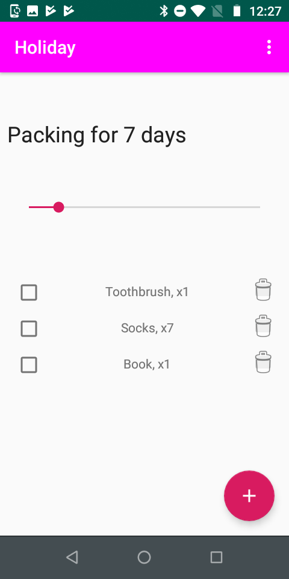

# Dokumentasjon - Modulist  
Dette er dokumentet som beskrives i krav 2 i [oppgaveteksten](./oppgavetekst.pdf).

- [Dokumentasjon - Modulist](#dokumentasjon---modulist)
  - [Om oppgaven](#om-oppgaven)
    - [Ide og formaal](#ide-og-formaal)
  - [Beskrivelse av min loesning](#beskrivelse-av-min-loesning)
    - [Eksempel:](#eksempel)
      - [Pakke til ferie](#pakke-til-ferie)
      - [Pakke til sommerferie](#pakke-til-sommerferie)
      - [Pakke til vinterferie](#pakke-til-vinterferie)
    - [Utviklingav konseptet](#utviklingav-konseptet)
  - [Appens muligheter](#appens-muligheter)
    - [Liste](#liste)
      - [Hovedfunkjsonalitet](#hovedfunkjsonalitet)
      - [Meny](#meny)
    - [Vaerplanlegging](#vaerplanlegging)
    - [Settings](#settings)
    - [Tutorials](#tutorials)
  - [Skjermer](#skjermer)
  - [Tidlige skisser](#tidlige-skisser)
  - [Arkitektur](#arkitektur)
  - [Brukertesting](#brukertesting)
  - [Visuelt](#visuelt)
  - [Publisering](#publisering)
  - [Kildeliste](#kildeliste)
  - [Vedlegg](#vedlegg)

## Om oppgaven 
Oppgaven her var å skrive en appliksasjon som implementerte _Tic Tac Toe_ ("bondesjakke"). I tillegg var det krav om følgende: 
1. Applikasjonen skal ha et tydelig definert konsept og formål
2. Applikasjonen skal ha en Fragment-arkitektur.
3. Applikasjonen skal gjøre bruk av et eksternt API. 
4. Applikasjonen skal gjøre bruk av en lokal database. 
5. Applikasjonen skal ha multimedia innhold.
6. Applikasjonen skal ha lokasjonsdata og/eller kart.
7. Applikasjonen skal gjøre bruk av sensordata.

### Ide og formaal 
Dersom man lager en del pakkelister, merker man fort at det oppstaar noen problemer: 
1. Selv om de er praktiske, er blir de fort tidkrevende aa lage
2. De blir vanskelige aa vedlikeholde og oppdatere over tid. 
3. Det er ofte kloenete aa kommunisere hvor mye man skal pakke avhengig av lengden paa turen

Utfordring 1 og 2 har nemlig samme opphav: duplisering av innhold paa tvers av lister. Duplisering foerer til at man maa bruke mer tid paa la lage dem. Mengden jobb ved oppddatering av punkter vil skalere proposjonalt med antall som har punktet (se [eksempel](#eksempel)). 

For aa loese disse problemene, har jeg latt meg inspirere av et annet domene med noen av de samme utfordringene - programvareutvikling. Spesielt har jeg latt meg inspirere av arv-mekanismen i objektorientert programmering. 

Utfordring nummer 3 kan loeses veldig greit med noe datamaskiner er veldig gode til: enkle regnestykker. 

Oppsummert, er formaalet altsaa aa loese de nevnte utfordringene, samtidig som jeg dekker kravene som oppgaven stiller paa en god maate. 

## Beskrivelse av min loesning 
Resultatet har blitt en app hvor man lager "modulaere pakkelister" - Module-lists - Modulist.
_Modulist_ lar brukeren lage pakkelister. Pakkelistene kan saa "utvides" av andre pakkelister. Utvidningen bestaar i at alle elementer i den foerste listen blir med til den nye. 

### Eksempel:

#### Pakke til ferie
* tannbørste
* telefon + lader
* minst to gode bøker

#### Pakke til sommerferie
* __Pakke til ferie__
* badebukse
* t-skjorter

#### Pakke til vinterferie
* __Pakke til ferie__
* minst to gode bøker
* vinterjakke
* ulgenser

Dette ser fint ut når listene er såpass korte som de er nå, men etter hvert som man bruker listene aktivt, vokser de; hver gang man glemmer noe, legger man det til, hver gang noe endrer seg, oppdater man osv. Listene blir både lengre og flere. Se for eksempel for deg at du kjøper en Kindle. Behovet for å drasse med seg to
tunge bøker er borte. Det må oppdateres i begge listene. Om man ser for seg at man har en påske- og høstfereliste
i tillegg, har man plutselig fire lister som må holdes synkronisert og oppdatert. Det blir fort kaos.
Her skal Modulist hjelpe.

### Utviklingav konseptet
Da jeg startet arbeidet ved semesterstart, var tanken å bygge en app som kunne dekke alle slags lister. Det være seg handlelister, pakkelister, generelle huskelister, osv.

Kjappe soek paa app-butikker, viser at liste-apper ikke akkurat er nytt territorium[1](#1)[2](#2). Markedet for generelle liste-apper er rett og slett et veldig vanskelig marked aa vaere i. Derfor skjoente jeg fort at min strategi maatte vaere aa spisse konseptet saa mye som mulig - satse paa et nisje-marked fremfor aa gaa for massene. 

Etter samtaler med venner og bekjente, kom jeg frem til at det spesielt var en type liste hvor flere så nytten av "liste-arv"-konseptet mitt:
pakkelister

Jeg reiser hyppig mellom ulike byer, og har derfor ogsaa mange pakkelister. Prosjektet ble derfor fort et lite "scratch my own itch"-prosjekt. Paa en side har dette vaert en fordel. Jeg har kjent min brukergruppe godt (jeg er den jo!). En potensiell ulempe er at jeg blir saa last i mine egne behov at jeg ikke forstaar markedet som helhet. Denne ulempen er hoeyst reell, men jeg hadde nok vurdert den som mer avgjoerende hvis jeg hadde gaatt for masse-markedet. 

I og med at jeg gaar for et nisje-marked uansett, har jeg landet paa at fordelene med aa vaere i brukergruppen veier opp for ulempene. 

En stund etter at oppgaven ble utdelt, tegnet jeg noen enkle skisser for aa forstaa hva jeg ville bygge foer jeg bygget dem. Disse omtales naermere [her](#tidilge-skisser).

## Appens muligheter 
### Liste
#### Hovedfunkjsonalitet
#### Meny  
### Vaerplanlegging 
### Settings 
### Tutorials 

## Skjermer 

## Tidlige skisser 

## Arkitektur 

## Brukertesting 

## Visuelt

## Publisering 
TODO: playstore 
Prosjektet ligger også på et [github-repo](https://github.com/olaven/modulist)

## Kildeliste 
* 1: https://play.google.com/store/search?q=todo&c=apps
* 2: https://itunes.apple.com/us/app/wunderlist-to-do-list-tasks/id406644151?mt=8#see-all/customers-also-bought-apps

## Vedlegg
 
 
 

 
 
 
 
 