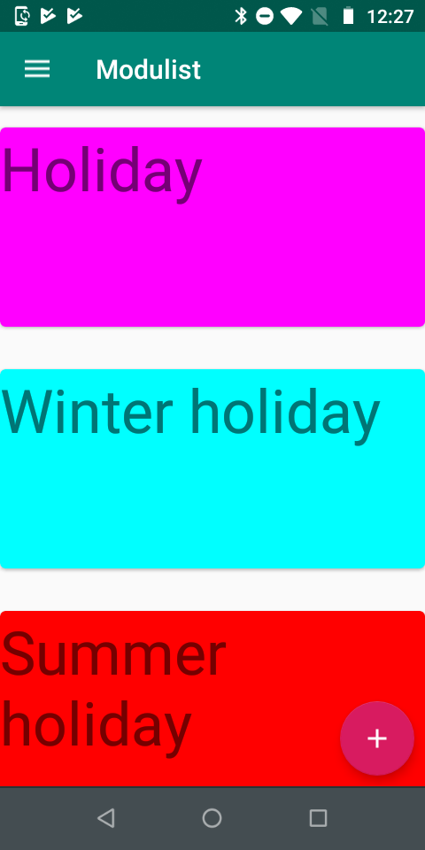
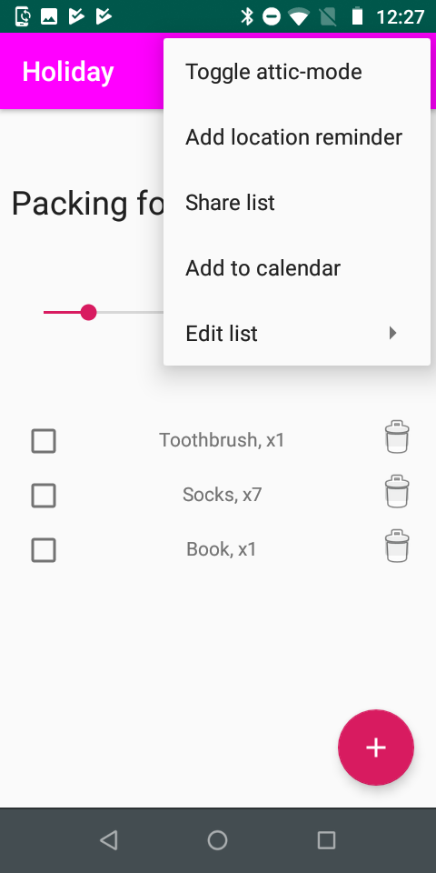
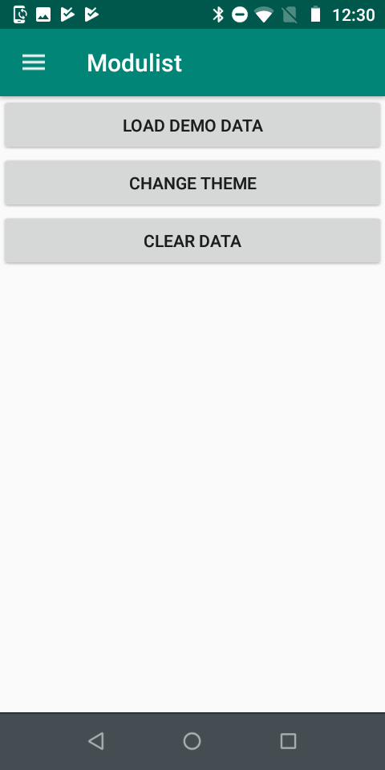

# Dokumentasjon - Modulist  
Dette er dokumentet som beskrives i krav 2 i [oppgaveteksten](./oppgavetekst.pdf).

- [Dokumentasjon - Modulist](#dokumentasjon---modulist)
  - [Om oppgaven](#om-oppgaven)
    - [Ide og formaal](#ide-og-formaal)
  - [Beskrivelse av min loesning](#beskrivelse-av-min-loesning)
    - [Eksempel:](#eksempel)
      - [Pakke til ferie](#pakke-til-ferie)
      - [Pakke til sommerferie](#pakke-til-sommerferie)
      - [Pakke til vinterferie](#pakke-til-vinterferie)
    - [Utviklingav konseptet](#utviklingav-konseptet)
  - [Appens muligheter](#appens-muligheter)
    - [Lister](#lister)
    - [Naviagasjon](#naviagasjon)
    - [Alle lister - skjermbilde](#alle-lister---skjermbilde)
    - [Se paa en spesifik liste - skjermbilde](#se-paa-en-spesifik-liste---skjermbilde)
    - [Vaerplanlegging - skjermbilde](#vaerplanlegging---skjermbilde)
    - [Settings - skjermbilde](#settings---skjermbilde)
    - [Tutorials](#tutorials)
  - [Tidlige skisser](#tidlige-skisser)
  - [Arkitektur](#arkitektur)
  - [Intents](#intents)
  - [Database](#database)
  - [Services og notifications](#services-og-notifications)
  - [Brukertest](#brukertest)
  - [Visuelt](#visuelt)
  - [Publisering](#publisering)
  - [Kildeliste](#kildeliste)
  - [Vedlegg](#vedlegg)
    - [Tidlig skisse](#tidlig-skisse)
    - [Skisse - lister](#skisse---lister)
    - [Skisse - listeflyt](#skisse---listeflyt)
    - [Skjermbilde - alle lister](#skjermbilde---alle-lister)
    - [Skjermbilde - en liste](#skjermbilde---en-liste)
    - [Skjermbilde - meny paa liste](#skjermbilde---meny-paa-liste)
    - [Skjermbilde - redigeringsmeny paa liste](#skjermbilde---redigeringsmeny-paa-liste)
    - [Skjermbilde - vaer-planlegging](#skjermbilde---vaer-planlegging)
    - [Skjermbilde - innstillinger](#skjermbilde---innstillinger)
    - [Skjermbilde - instruksjonsvideoer](#skjermbilde---instruksjonsvideoer)

## Om oppgaven 
Oppgaven her var å skrive en appliksasjon som implementerte _Tic Tac Toe_ ("bondesjakke"). I tillegg var det krav om følgende: 
1. Applikasjonen skal ha et tydelig definert konsept og formål
2. Applikasjonen skal ha en Fragment-arkitektur.
3. Applikasjonen skal gjøre bruk av et eksternt API. 
4. Applikasjonen skal gjøre bruk av en lokal database. 
5. Applikasjonen skal ha multimedia innhold.
6. Applikasjonen skal ha lokasjonsdata og/eller kart.
7. Applikasjonen skal gjøre bruk av sensordata.

### Ide og formaal 
Dersom man lager en del pakkelister, merker man fort at det oppstaar noen problemer: 
1. Selv om de er praktiske, er blir de fort tidkrevende aa lage
2. De blir vanskelige aa vedlikeholde og oppdatere over tid. 
3. Det er ofte kloenete aa kommunisere hvor mye man skal pakke avhengig av lengden paa turen

Utfordring 1 og 2 har nemlig samme opphav: duplisering av innhold paa tvers av lister. Duplisering foerer til at man maa bruke mer tid paa la lage dem. Mengden jobb ved oppddatering av punkter vil skalere proposjonalt med antall som har punktet (se [eksempel](#eksempel)). 

For aa loese disse problemene, har jeg latt meg inspirere av et annet domene med noen av de samme utfordringene - programvareutvikling. Spesielt har jeg latt meg inspirere av arv-mekanismen i objektorientert programmering. 

Utfordring nummer 3 kan loeses veldig greit med noe datamaskiner er veldig gode til: enkle regnestykker. 

Oppsummert, er formaalet altsaa aa loese de nevnte utfordringene, samtidig som jeg dekker kravene som oppgaven stiller paa en god maate. 

## Beskrivelse av min loesning 
Resultatet har blitt en app hvor man lager "modulaere pakkelister" - Module-lists - Modulist.
_Modulist_ lar brukeren lage pakkelister. Pakkelistene kan saa "utvides" av andre pakkelister. Utvidningen bestaar i at alle elementer i den foerste listen blir med til den nye. 

### Eksempel:
(__notis__: demo-lister kan legges til fra [innstillinger](#skjermbilde---innstillinger)]

#### Pakke til ferie
* tannbørste
* telefon + lader
* minst to gode bøker

#### Pakke til sommerferie
* __Pakke til ferie__
* badebukse
* t-skjorter

#### Pakke til vinterferie
* __Pakke til ferie__
* minst to gode bøker
* vinterjakke
* ulgenser

Dette ser fint ut når listene er såpass korte som de er nå, men etter hvert som man bruker listene aktivt, vokser de; hver gang man glemmer noe, legger man det til, hver gang noe endrer seg, oppdater man osv. Listene blir både lengre og flere. Se for eksempel for deg at du kjøper en Kindle. Behovet for å drasse med seg to
tunge bøker er borte. Det må oppdateres i begge listene. Om man ser for seg at man har en påske- og høstfereliste
i tillegg, har man plutselig fire lister som må holdes synkronisert og oppdatert. Det blir fort kaos.
Her skal Modulist hjelpe.

### Utviklingav konseptet
Da jeg startet arbeidet ved semesterstart, var tanken å bygge en app som kunne dekke alle slags lister. Det være seg handlelister, pakkelister, generelle huskelister, osv.

Kjappe soek paa app-butikker, viser at liste-apper ikke akkurat er nytt territorium[1](#1)[2](#2). Markedet for generelle liste-apper er rett og slett et veldig vanskelig marked aa vaere i. Derfor skjoente jeg fort at min strategi maatte vaere aa spisse konseptet saa mye som mulig - satse paa et nisje-marked fremfor aa gaa for massene. 

Etter samtaler med venner og bekjente, kom jeg frem til at det spesielt var en type liste hvor flere så nytten av "liste-arv"-konseptet mitt:
pakkelister

Jeg reiser hyppig mellom ulike byer, og har derfor ogsaa mange pakkelister. Prosjektet ble derfor fort et lite "scratch my own itch"-prosjekt. Paa en side har dette vaert en fordel. Jeg har kjent min brukergruppe godt (jeg er den jo!). En potensiell ulempe er at jeg blir saa last i mine egne behov at jeg ikke forstaar markedet som helhet. Denne ulempen er hoeyst reell, men jeg hadde nok vurdert den som mer avgjoerende hvis jeg hadde gaatt for masse-markedet. 

I og med at jeg gaar for et nisje-marked uansett, har jeg landet paa at fordelene med aa vaere i brukergruppen veier opp for ulempene. 

En stund etter at oppgaven ble utdelt, tegnet jeg noen enkle skisser for aa forstaa hva jeg ville bygge foer jeg bygget dem. Disse omtales naermere [her](#tidlige-skisser).

## Appens muligheter 
(__notis__: demo-lister kan legges til fra [innstillinger](#skjermbilde---innstillinger)]
### Lister

### Naviagasjon   
TODO skriv om navigasjonen 

### Alle lister - [skjermbilde](#skjermbilde---alle-lister)
Denne skjermen er det foerste som moeter brukeren naar det starter appen. 
Sidne gir enkel tilgang til selve listene. 

For aa legge til lister, trykker man paa en "Floating Action Button" (FAB) som vises i hjoernet. Dette er standard i Material Design, og er forholdsvis kjent for de fleste Android-brukere[3](#3). Naar man lager en liste, faar brukeren tre valg. Legge til et navn, legge til en farge, og legge de listene man vil arve elementer fra. Jeg fikk veldig positiv tilbakemelding paa at man hadde mulighet for aa legge til sine egne farger.

Muligheten for aa legge til de man arver fra, var litt mer forvirrende. Allikevel har jeg valgt aa ha det inne fordi det er sapass sentralt til hensiktene med appen. Denne forvirringen har allikevel blit imoetegaatt med [instruksjonsvideoer](#skjermbilde---instruksjonsvideoer) som skal gjoere det lettere aa laere seg hvordan appen fungerer. 

### Se paa en spesifik liste - [skjermbilde](#skjermbilde--en-liste)
Paa mange maater er dette den viktigste siden i appen; det er her brukeren jobber med selve pakkelistene. 

Her vises b.la. et "Seekbar"-element. Den brukes til aa juster til hvor mange dager man oensker aa pakke for. Naar den endres, oppdateres listene fortoepende. Til aa begynne med hadde jeg denne paa 0 som default. Da var tanken at brukeren selv skulle legge inn dager hver gang. I [brukertestene](#brukertest) oppdaget jeg at de mindre app-vante brukerene ikke oppfattet muligheten for aa justere antall dager i det hele tatt. Derfor har jeg satt den som litt "scrollet" (til 7) som default. Da forsvant problemet. 

Under dem har man selve elementene. De gir ganske enkelt mulighet for aa huke av- og slette elementer. Hvert element er kun knyttet til en liste, men dersom man forsoeker aa slette dem, vil de fjernes i "barne-listene" ogsaa. Det faar man en varsling om naar man sletter. 

Nederst i hoeyre gjoerne har man en "Floating Action Button" for aa legge til nye liste-elementer. Prosessen tilsvarer aa legge til nye liste. Nye elementer legges ogsaa automatisk til "barne-lister". Naar man legger til et element faar man mulighet til aa legge til navn og _hyppighet_. Hyppighet handler om hvor mange dager som maa gaa foer man trenger aa pakke flere av elementet. 

Foerste gangen de fikk valget om hyppighet, synes de fleste brukerene at det var litt forvirrende. Derimot forsto saa godt som alle brukerene hva det var etter at elementet var lagt til. Terskelen for aa fjerne/legge til elemeenter er veldig lav, og derfor har jeg ikke gjort noen store endringer her. 

I app-baren ligger en [standard-meny](https://developer.android.com/guide/topics/ui/menus) (skjermbilde [her](#skjermbilde---meny-paa-liste)) som gir brukeren en rekke muligheter: 
* _Toggle attic mode_
    
    "Attic Mode" bruker telefonens sensordata for aa gi ekstrafunksjonalitet. Tanken er at man vil befinne seg paa loftet fra tid til annen, naar man pakker. Ekstrafunksjonliteten bestaar av at telefonens lommelykt skrur seg paa nar det er moerkt rundt, og man vil faa en varsel om aa ta tak i en genser om det er kaldt. Det er viktig aa ta vare paa brukerens helse <3 
* _Add location reminder_
  
    Her gis det mulighet til aa legge til paaminnelser naar man ankommer et omraade. En typisk use-case kan vaere "minne meg paa a pakke naar jeg naermer meg hjem-adresssen min". For a aapnaa dette, bruker jeg [geofencing](https://developer.android.com/training/location/geofencing).
* _Share list_

    Denne muligheten gir brukeren mulighet til aa dele listene i tekstform, f.eks. via SMS eller mail. Alle apper som aapner for deling, kan koble seg paa dette. 
* _Add to calendar_

    Lar brukeren legge til et kalender-event i kalenderen sin, basert paa listen. Akkurat som med delingen, kan brukeren velge sin egen app for haandtering her. Som default (og i min testing, primaert) har det vaert Google Calendar. 
* _Edit list_ - [skjermbilde](#skjermbilde---redigeringsmeny-paa-liste)

    Listene skal leve over tid, og man skal kunne endre dem. Da kommer denne under-menyen inn! Her kan man oppdatere listens navn, "foreldre-lister" og farge, samt sletting av lister. 

### Vaerplanlegging - [skjermbilde](#skjermbilde---vaer-planlegging)
Pakking foregaar i all hovedsak foer man skal dra til et sted. Derfor har jeg lagt inn en "Weather-Planner" i appen min. Den henter data fra [Weatherbit](api.weatherbit.io). Data visualiseres i grafen. 

### Settings - [skjermbilde](#skjermbilde---innstillinger)
Det er tre instillinger tilgjengelig. 
* legge til demo-data -> fin naar man skal laere seg aa bruke appen 
* endre tema -> fargetemaer som lar brukeren tilpasse appen 
* slette data -> gjoer akkurat det den sier 

### Tutorials 
Som nevnt tidligere i dette dokumentet, har appen en viss laeringskurve. Derfor har jeg lagt til instruksjonsvideoer som brukeren kan benytte seg av. Alle hovedfunkjsonliteter demonstreres i videoene.  

## Tidlige skisser 

## Arkitektur 

## Intents 

## Database 

## Services og notifications 

## Brukertest

## Visuelt

## Publisering 
TODO: playstore 
Prosjektet ligger også på et [github-repo](https://github.com/olaven/modulist)

## Kildeliste 
* 1: https://play.google.com/store/search?q=todo&c=apps
* 2: https://itunes.apple.com/us/app/wunderlist-to-do-list-tasks/id406644151?mt=8#see-all/customers-also-bought-apps
* 3: Uspesifiert forfatter, Google. 2019. “Floating Action Buttons”. https://material.io/develop/android/components/floating-action-button/ (lastet ned 27. April 2019)

## Vedlegg
### Tidlig skisse 
 
### Skisse - lister 
 
### Skisse - listeflyt 
 
### Skjermbilde - alle lister 

### Skjermbilde - en liste
 
### Skjermbilde - meny paa liste 
 
### Skjermbilde - redigeringsmeny paa liste 
 
### Skjermbilde - vaer-planlegging 
 
### Skjermbilde - innstillinger 
 
### Skjermbilde - instruksjonsvideoer
 