# Dokumentasjon - Modulist  
Dette er dokumentet som beskrives i krav 2 i [oppgaveteksten](./oppgavetekst.pdf).

- [Dokumentasjon - Modulist](#dokumentasjon---modulist)
  - [Om oppgaven](#om-oppgaven)
    - [Ide og formål](#ide-og-form%C3%A5l)
  - [Beskrivelse av min løsning](#beskrivelse-av-min-l%C3%B8sning)
    - [Eksempel:](#eksempel)
      - [Pakke til ferie](#pakke-til-ferie)
      - [Pakke til sommerferie](#pakke-til-sommerferie)
      - [Pakke til vinterferie](#pakke-til-vinterferie)
    - [Utvikling av konseptet](#utvikling-av-konseptet)
  - [Appens muligheter](#appens-muligheter)
    - [Lister](#lister)
    - [Naviagasjon - skjermbilde](#naviagasjon---skjermbilde)
    - [Alle lister - skjermbilde](#alle-lister---skjermbilde)
    - [Se på en spesifik liste - skjermbilde](#se-p%C3%A5-en-spesifik-liste---skjermbilde)
      - [Meny](#meny)
    - [Værplanlegging - skjermbilde](#v%C3%A6rplanlegging---skjermbilde)
    - [Settings - skjermbilde](#settings---skjermbilde)
    - [Tutorials](#tutorials)
  - [Tidlige skisser](#tidlige-skisser)
  - [Arkitektur](#arkitektur)
    - [Fragment](#fragment)
    - [Actvities](#actvities)
    - [App-klassen](#app-klassen)
      - [Konstanter](#konstanter)
      - [Notifications](#notifications)
    - [Permissions](#permissions)
    - [Database](#database)
    - [Lokal lagring generelt](#lokal-lagring-generelt)
    - [Multithreading](#multithreading)
  - [Intents](#intents)
  - [Services og notifications](#services-og-notifications)
  - [Strings](#strings)
  - [Brukertest](#brukertest)
  - [Visuelt](#visuelt)
  - [Support-bibliotek](#support-bibliotek)
  - [Øvrige bibliotek](#%C3%B8vrige-bibliotek)
  - [Versjoner](#versjoner)
  - [Navngivning](#navngivning)
  - [Publisering](#publisering)
  - [Kildeliste](#kildeliste)
  - [Vedlegg](#vedlegg)
    - [Tidlig skisse](#tidlig-skisse)
    - [Skisse - lister](#skisse---lister)
    - [Skisse - listeflyt](#skisse---listeflyt)
    - [Skjermbilde - navigasjon](#skjermbilde---navigasjon)
    - [Skjermbilde - alle lister](#skjermbilde---alle-lister)
    - [Skjermbilde - en liste](#skjermbilde---en-liste)
    - [Skjermbilde - meny på liste](#skjermbilde---meny-p%C3%A5-liste)
    - [Skjermbilde - redigeringsmeny på liste](#skjermbilde---redigeringsmeny-p%C3%A5-liste)
    - [Skjermbilde - vær-planlegging](#skjermbilde---v%C3%A6r-planlegging)
    - [Skjermbilde - innstillinger](#skjermbilde---innstillinger)
    - [Skjermbilde - instruksjonsvideoer](#skjermbilde---instruksjonsvideoer)

## Om oppgaven 
Oppgaven her var å lage en applikasjon. I dette dokumetnet skal jeg beskrive løsningen min. Det være seg hvordan koden er strukturert, hvorfor jeg har tatt de valgene jeg har tatt, og hvorfor den treffer målet om å være en god applikasjon. 

Hva slags applikasjon det skulle være, sto man ganske fritt til å velge, innenfor visse rammer: 
1. Applikasjonen skal ha et tydelig definert konsept og formål
2. Applikasjonen skal ha en Fragment-arkitektur.
3. Applikasjonen skal gjøre bruk av et eksternt API. 
4. Applikasjonen skal gjøre bruk av en lokal database. 
5. Applikasjonen skal ha multimedia innhold.
6. Applikasjonen skal ha lokasjonsdata og/eller kart.
7. Applikasjonen skal gjøre bruk av sensordata.


### Ide og formål 
Dersom man lager en del pakkelister, merker man fort at det oppstår noen problemer: 
1. Selv om de er praktiske, er blir de fort tidkrevende å lage
2. De blir vanskelige å vedlikeholde og oppdatere over tid. 
3. Det er ofte klønete å kommunisere hvor mye man skal pakke avhengig av lengden på turen

Utfordring 1 og 2 har nemlig samme opphav: duplisering av innhold på tvers av lister. Duplisering fører til at man må bruke mer tid på la lage dem. Mengden jobb ved oppddatering av punkter vil skalere proposjonalt med antall som har punktet (se [eksempel](#eksempel)). 

For å løse disse problemene, har jeg latt meg inspirere av et annet domene med noen av de samme utfordringene - programvareutvikling. Spesielt har jeg latt meg inspirere av arv-mekanismen i objektorientert programmering. 

Utfordring nummer 3 kan løses veldig greit med noe datamaskiner er veldig gode til: enkle regnestykker. 

Oppsummert, er formålet altså å løse de nevnte utfordringene, samtidig som jeg dekker kravene som oppgaven stiller på en god måte. 

## Beskrivelse av min løsning 
Resultatet har blitt en app hvor man lager "modulære pakkelister" - Module-lists - Modulist.
_Modulist_ lar brukeren lage pakkelister. Pakkelistene kan så "utvides" av andre pakkelister. Utvidningen består i at alle elementer i den første listen blir med til den nye. 


### Eksempel:
(__notis__: demo-lister kan legges til fra [innstillinger](#skjermbilde---innstillinger)]

#### Pakke til ferie
* tannbørste
* telefon + lader
* minst to gode bøker

#### Pakke til sommerferie
* __Pakke til ferie__
* badebukse
* t-skjorter

#### Pakke til vinterferie
* __Pakke til ferie__
* minst to gode bøker
* vinterjakke
* ulgenser

Dette ser fint ut når listene er såpass korte som de er nå, men etter hvert som man bruker listene aktivt, vokser de; hver gang man glemmer noe, legger man det til, hver gang noe endrer seg, oppdater man osv. Listene blir både lengre og flere. Se for eksempel for deg at du kjøper en Kindle. Behovet for å drasse med seg to
tunge bøker er borte. Det må oppdateres i begge listene. Om man ser for seg at man har en påske- og høstfereliste
i tillegg, har man plutselig fire lister som må holdes synkronisert og oppdatert. Det blir fort kaos.
Her skal Modulist hjelpe.

### Utvikling av konseptet
Da jeg startet arbeidet ved semesterstart, var tanken å bygge en app som kunne dekke alle slags lister. Det være seg handlelister, pakkelister, generelle huskelister, osv.

Kjappe søk på app-butikker, viser at liste-apper ikke akkurat er nytt territorium[<sup>1</sup>](#1)[<sup>2</sup>](#2). Markedet for generelle liste-apper er rett og slett et veldig vanskelig marked å være i. Derfor skjønte jeg fort at min strategi måtte være å spisse konseptet så mye som mulig - satse på et nisje-marked fremfor å gå for massene. 

Etter samtaler med venner og bekjente, kom jeg frem til at det spesielt var en type liste hvor flere så nytten av "liste-arv"-konseptet mitt:
pakkelister

Jeg reiser hyppig mellom ulike byer, og har derfor også mange pakkelister. Prosjektet ble fort et lite "scratch my own itch"-prosjekt. På en side har dette vært en fordel. Jeg har kjent min brukergruppe godt (jeg er den jo!). En potensiell ulempe er at jeg blir så last i mine egne behov at jeg ikke forstår markedet som helhet. Denne ulempen er høyst reell, men jeg hadde nok vurdert den som mer avgjørende hvis jeg hadde gått for masse-markedet. 

I og med at jeg går for et nisje-marked uansett, har jeg landet på at fordelene med å være i brukergruppen veier opp for ulempene. 

En stund etter at oppgaven ble utdelt, tegnet jeg noen enkle skisser for å forstå hva jeg ville bygge før jeg bygget dem. Disse omtales nærmere [her](#tidlige-skisser).

## Appens muligheter 
(__notis__: demo-lister kan legges til fra [innstillinger](#skjermbilde---innstillinger)]
### Lister

### Naviagasjon - [skjermbilde](#skjermbilde---navigasjon)
Jeg har valgt en enkel navigasjonsmeny på siden. Dette er en klassisk "Navigation Drawer", og er 
veien brukeren har til hele applikasjonen. 

Et annet alternativ jeg kunne valgt er en "Navigation Bar" på bunnen. Disse er også fine og lett tilgjengelige, men det første alternativet har to fordeler som avgjorde: 
1. "Drawer"-menyen krasjer ikke med Androids veletablerte bunnmeny, som allerede ligger der på mange telefoner ("tilbake", "hjem", "options")
2. En drawer har mer plass vertikalt enn en bunnmeny er horisontalt. Den plassen kan komme godt med dersom man skal legge til nye features, som krever flere navigasjonsmuligheter.

### Alle lister - [skjermbilde](#skjermbilde---alle-lister)
Denne skjermen er det første som møter brukeren når det starter appen. 
Sidne gir enkel tilgang til selve listene. 

For å legge til lister, trykker man på en "Floating Action Button" (FAB) som vises i hjørnet. Dette er standard i Material Design, og er forholdsvis kjent for de fleste Android-brukere[<sup>3</sup>](#3). Når man lager en liste, får brukeren tre valg. Legge til et navn, legge til en farge, og legge de listene man vil arve elementer fra. Jeg fikk veldig positiv tilbakemelding på at man hadde mulighet for å legge til sine egne farger.

Muligheten for å legge til de man arver fra, var litt mer forvirrende. Allikevel har jeg valgt å ha det inne fordi det er sapass sentralt til hensiktene med appen. Denne forvirringen har allikevel blit imøtegått med [instruksjonsvideoer](#skjermbilde---instruksjonsvideoer) som skal gjøre det lettere å lære seg hvordan appen fungerer. 

### Se på en spesifik liste - [skjermbilde](#skjermbilde--en-liste)
På mange måter er dette den viktigste siden i appen; det er her brukeren jobber med selve pakkelistene. 

Her vises b.la. et "Seekbar"-element. Den brukes til å juster til hvor mange dager man ønsker å pakke for. Når den endres, oppdateres listene fortøpende. Til å begynne med hadde jeg denne på 0 som default. Da var tanken at brukeren selv skulle legge inn dager hver gang. I [brukertestene](#brukertest) oppdaget jeg at de mindre app-vante brukerene ikke oppfattet muligheten for å justere antall dager i det hele tatt. Derfor har jeg satt den som litt "scrollet" (til 7) som default. Da forsvant problemet. 

Under dem har man selve elementene. De gir ganske enkelt mulighet for å huke av- og slette elementer. Hvert element er kun knyttet til en liste, men dersom man forsøker å slette dem, vil de fjernes i "barne-listene" også. Det får man en varsling om når man sletter. 

Nederst i høyre gjørne har man en "Floating Action Button" for å legge til nye liste-elementer. Prosessen tilsvarer å legge til nye liste. Nye elementer legges også automatisk til "barne-lister". Når man legger til et element får man mulighet til å legge til navn og _hyppighet_. Hyppighet handler om hvor mange dager som må gå før man trenger å pakke flere av elementet. 

Første gangen de fikk valget om hyppighet, synes de fleste brukerene at det var litt forvirrende. Derimot forsto så godt som alle brukerene hva det var etter at elementet var lagt til. Terskelen for å fjerne/legge til elemeenter er veldig lav, og derfor har jeg ikke gjort noen store endringer her. 

#### Meny
I app-baren ligger en [standard-meny](https://developer.android.com/guide/topics/ui/menus) (skjermbilde [her](#skjermbilde---meny-på-liste)) som gir brukeren en rekke muligheter: 
* _Toggle attic mode_
    
    "Attic Mode" bruker telefonens sensordata for å gi ekstrafunksjonalitet. Tanken er at man vil befinne seg på loftet fra tid til annen, når man pakker. Ekstrafunksjonliteten består av at telefonens lommelykt skrur seg på nar det er mørkt rundt, og man vil få en varsel om å ta tak i en genser om det er kaldt. Det er viktig å ta vare på brukerens helse <3 
* _Add location reminder_
  
    Her gis det mulighet til å legge til påminnelser når man ankommer et område. En typisk use-case kan være "minne meg på a pakke når jeg nærmer meg hjem-adresssen min". For a åpnå dette, bruker jeg [geofencing](https://developer.android.com/training/location/geofencing).
* _Share list_

    Denne muligheten gir brukeren mulighet til å dele listene i tekstform, f.eks. via SMS eller mail. Alle apper som åpner for deling, kan koble seg på dette. 
* _Add to calendar_

    Lar brukeren legge til et kalender-event i kalenderen sin, basert på listen. Akkurat som med delingen, kan brukeren velge sin egen app for håndtering her. Som default (og i min testing, primært) har det vært Google Calendar. 
* _Edit list_ - [skjermbilde](#skjermbilde---redigeringsmeny-på-liste)

    Listene skal leve over tid, og man skal kunne endre dem. Da kommer denne under-menyen inn! Her kan man oppdatere listens navn, "foreldre-lister" og farge, samt sletting av lister. 

### Værplanlegging - [skjermbilde](#skjermbilde---vær-planlegging)
Pakking foregår i all hovedsak før man skal dra til et sted. Derfor har jeg lagt inn en "Weather-Planner" i appen min. Den henter data fra [Weatherbit](api.weatherbit.io). Data visualiseres i grafen. 

### Settings - [skjermbilde](#skjermbilde---innstillinger)
Det er tre instillinger tilgjengelig. 
* legge til demo-data -> fin når man skal lære seg å bruke appen 
* endre tema -> fargetemaer som lar brukeren tilpasse appen 
* slette data -> gjør akkurat det den sier 

### Tutorials 
Som nevnt tidligere i dette dokumentet, har appen en viss læringskurve. Derfor har jeg lagt til instruksjonsvideoer som brukeren kan benytte seg av. Alle hovedfunkjsonliteter demonstreres i videoene.  

## Tidlige skisser 
Jeg begynte å skisse til oppgaven ganske tidlig. Da de ble tegnet, hadde jeg [som nevnt](#utvikling-av-konseptet) tenkt til å lage mulighet for mer generelle lister. Allikevel har hovedtrekkne i skissene holdt seg igjen i det endelige resultatet. 

Den [tidligeste skssen](#tidlig-skisse) viser noen små skisser og en haug med stikkord. Her hadde jeg en tett kopling mellom en liste og en lokasjon. Notatene viser også at jeg hadde delt inn listene i kategoriene. Dette har jeg (med unntak av location reminders) gått litt bort fra, for å unnga unødvendig kompleksitet. 

[Neste skisse](#skisse---lister) viser en sketsj for en hovedskjerm, og utviding av lister. Selve liste-siden er ganske enkel i denne skissen, omtrent som i sluttlisten. "Seekbar"-menyen for antall dager dukker ikke opp her, fordi dette ble tegnet før konseptet var spisset mot pakking. 

Hjem-skjermen som vises i denne skissen, er ganske annerledes enn den som er i [resultatet](#skjermbilde---alle-lister). Her har man støtte for å lege til lister som "favoritter" og som "aktuelle". Listene vises også i horisontale views. Dette var lenge en de lav appen, men jeg gikk etter hvert bort fra det. Også her handlet det om å unngå unødvendig kompleksitet. 

Øverst i venstre hjørene ser man at en basis for det som i dag ligger i [menyen](#meny) er til stede. ideene om å dele lister og legge dem til i kalenderen har kommet inn, sammen med geofence-reminders (HER: "Add location at"). 

## Arkitektur 

### Fragment 
Programmet bruker en fragment-arkitektur, slik som 
oppgaven spesifiserer. Fragments gir en fordel over activities her fordi de er mindre ressurskrevende å starte opp enn activities. 
Fragments er mer fleksible enn activities var tenkt til å være. De kan gjenbrukes og, dersom man ønsker, kan man ha flere i samme skjerm (f.eks endring ved rotasjon). Det er ikke anbefalt at de skal være så store. De skal dele opp ganske store bolker. 

Alle skjermer som kan nåes fra [navigasjonsmenyen](#navgasjonsmeny), bytter ut innholdet i en hoved-activity, `MainActivity.kt`.

Jeg bruker kun ett fragment om gangen, og jeg har låst appen i portraint-rotasjon. Derfor er det først og fremst kostnaden ved å starte en fragment som jeg sparer. Det er fint her ved kjapp navigering mellom fragments. 

Rotasjons-låsingen er slik som den er fordi hovedfunksjonaliteten i appen ikke er av en type hvor det er naturlig med landscape-rotasjon. Dersom appens fokus hadde vært å lese lange artikler, se på bilder, film eller lignende, ville det derimot vært mer naturlig. Denne appen skal vise lange, verttikale lister. Da ville landscape-modus skapt mer scrolling og unødvendig tap av brukervennlighet. Det er også få mennesker som faktisk bruker telefoner i landscape, særlig på Android[<sup>4</sup>](#4).

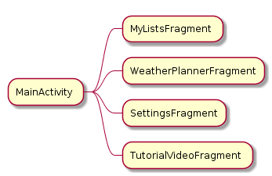

å bytte fragmens innebærer bare å sjekke hvilket element i navigasjonsmenyen som klikkes, og så bytte gjennom en `FragmentManager`. 
```kotlin

class MainActivity : BaseActivity() {

    private fun setupDrawerItemListeners() {
            
        activity_main_navigation_view.bringToFront()
        activity_main_navigation_view.setNavigationItemSelectedListener {
            when (it.itemId) {
                R.id.nav_my_lists -> replaceMainFragment(MyListsFragment())
                R.id.nav_weather_planner -> replaceMainFragment(WeatherPlannerFragment())
                R.id.nav_settings -> replaceMainFragment(SettingsFragment())
                R.id.nav_tutorial_videos -> replaceMainFragment(TutorialVideoFragment())
            }
            activity_main_drawer.closeDrawer(Gravity.START)
            true
        }
    }

    fun replaceMainFragment(fragment: Fragment) {

        supportFragmentManager.beginTransaction()
            .addToBackStack(null)
            .replace(R.id.activity_base_frame_layout, fragment)
            .commit()
    }
}
// NOTE: kode som ikke er relevant for eksempel er fjernet 
```

### Actvities
Activities er et eget GUI-vindu i Android, som kan startes i Android. En stor del av Android sin filosofi er at ting kan startes fra forskjellige steder: en app kan starte en annen app, osv[<sup>5</sup>](#5). Dette gjøres gjerne gjennom intents ([mer senere](#intents)) som starter activities. 


(bilde[<sup>6</sup>](#6))

Activities har sin egen livssyklus, med tilhørende metoder, som figuren over viser. Disse brukes til initialisering og "teardown"-hendelser i applikasjonen. Her bruker jeg særlig oppstartsmetodene til å intiere det som skal skje, sette opp lyttere o.l.
```kotlin 
//MainActivity.kt
override fun onCreate(savedInstanceState: Bundle?) {

    super.onCreate(savedInstanceState)

    setContentView(R.layout.activity_main)
    replaceMainFragment(MyListsFragment())
    setUpActionBarWithDrawer()
    setupDrawerItemListeners()
}
```

Metodene kan også brukes for å lagre states fra input o.l. Da kan man lagre dette i et bundle-objekt, som sendes i `savedInstanceState: Bundle?`. Det håndteres imidlertid ganske godt av Android fra før, og jeg har ikke opplevt problemer ved bruk av appen. Derfor har jeg heller ikke håndtert dette manuelt. 

Jeg har to activities som vises til brukeren, som begge er subklasser av en felles `BaseActivity.kt`: [Klassediagram for Actvity-klassene](photos/diagrams/activity-diagram-class.png)

Jeg kunne valgt å vise en liste i et fragment, sann som med de andre delene av appen min. Dette ville vært hakket kjapperet, av [nevnte](#fragment) årsaker. Allikevel har jeg ønsket å ha det i en fragment, av to årsaker: 
1. en activity spretter opp som et eget vindu. Når jeg apner en liste i appen min, _føles det riktig_, rett og slett; jeg er ferdig med å navigere og bruke appens mange ekstrafunksjonaliteter. Nå skal jeg fokusere på å pakke. 
2. For å integrere bedre med andre apper på telefonen, hadde det vært stilig dersom andre apper kunne starte aktiviteten til en gitt liste. Dette kan man gjøre med intent-fitlers. Per i dag ligger ikke den type funksjonalitet i appen, men det er et hav av muligheter som kunne være veldig spennende. Derfor har jeg ønsket å holde døren åpen. 

I Android kan man som nevnt forvente at activities kan startes av andre applikasjoner. Bruksflyten er mer sporadisk, og jeg må forvente at begge activities er det første en bruker møter. Derfor må jeg håndtere noen ting begge steder. I mitt tilfelle: å legge på fargetema, og å hente inn tillatelser til å bruke lokasjonstjenester(geofencing) og kamera(lys). Kodebiten som gjør det, er vist nedenfor. 
``` kotlin 
override fun onCreate(savedInstanceState: Bundle?) {

    applyTheme()
    checkPermissionForLocation()
    checkPermissionForCamera()
    super.onCreate(savedInstanceState)
}
```

### App-klassen 
Jeg har laget en Applikasjonsklasse som extender `android.app.Application`. Den er definert i `AndroidManifest.xml`, slik at den kjører som hoved-applikasjonsklasse for programmet. Jeg bruker denne klassen til to ting: Konstanter og oppretting av en "notification channels". 

#### Konstanter
Appen noen konstanter som trengs i løpet av appens liv. Det er API-nøkler og diverse ID'er for requestkoder. De ligger tilgjengelig som statiske klassevariable `App.kt`. 

Det er ikke optimalt å legge API-nøkler på denne måten. Allikevel har jeg valgt å gjøre det i dette tilfellet. Delvis fordi det er enklere, men først og fremst av grunnene som står i kommentarene under: 

#### Notifications 
I nyere versjoner av Android, er man nødt til å opprette "Notification Channels" for å sende Notificaiotions til brukeren. Formålet med dette er at brukeren skal få mer kontroll over notifikasjone som sendes fra ulike apper. Hvis en app registrerer forskjellige "Channels", kan en bruker legge ulike innstillinger på hver av dem[<sup>7</sup>](#7)

En "Channel" har en ID, et nan og et vitkighetsnivå. Jeg har valgt å sette viktighetsnivået til `NotificaionManager.IMPORTANCE_DEFAULT`. Mine varsler (for å pakke) er ikke noe jeg anser som veldig viktig. Det er heller ikke uviktig. Med "default"-viktighetsnivået vil en notification spille lyd og dukke opp i status bar[<sup>8</sup>](#8). 

```kotlin
private fun createNotificationChannels() {

    // ta høyede for endringer i notifikasjoner i android O
    if (Build.VERSION.SDK_INT >= Build.VERSION_CODES.O) {

        val channel = NotificationChannel(
            CHANNEL_ID,
            CHANNEL_NAME,
            NotificationManager.IMPORTANCE_DEFAULT
        )
        channel.description = "Main channel for modulist notificaions"

        val manager = getSystemService(Service.NOTIFICATION_SERVICE) as NotificationManager
        manager.createNotificationChannel(channel)
    }
}
```

### Permissions 
Av tillatelsene jeg krever av brukeren, må jeg be om følgende eksplisitt: 
* ACCESS_FINE_LOCATION
* CAMERA

Det er fordi at det står på [Google sin liste](https://developer.android.com/guide/topics/permissions/overview#permission-groups) over "Dangerous Permissions". Jeg ber om tillatelser når en av de to activitiene starter opp starter opp. Jeg viser også en melding som viser hvorfor jeg trenger tillatelser. Hvis brukeren velger å svare nei _og_ sier at de ikke ønsker å bli spurt igjen, er reglene fra Android slik at jeg ikke har lov til å spørre igjen[<sup>9</sup>](#9). Dersom en bruker forsøker å bruke en av mulighetene som krever kamera eller lokasjon (henholdsvis "Attic Mode" og "Location Reminder"), forteller jeg at appen ikke har tillatelse i en "Snackbar", og gir en knapp som går til instillinger, slik at brukeren kan rette opp idet, dersom det er ønskelig.

### Database  
Å lese fra en database er en forholdsvis tidkrevende prosess. Derfor er det viktig at dette ikke gjøres på samme tråd som kjører brukergrensesnittet ("UI-tråden"). Da vil man blokkere alt annet som skjer, grensesnittet mot brukeren vil henge dersom ting tar tid. Det senker brukeropplevelsen. På databaser er det faktisk så nøye at Android i utgangspuntket ikke lar deg kjøre database kall på UI-tråden i det hele tatt. 

For å håndtere dette, har jeg brukt arkitekturen som har blitt brukt i forelesning, og som Google har på sine eksempelsider[<sup>10</sup>](#10). Den bygger på [@WorkerThread](https://developer.android.com/reference/android/support/annotation/WorkerThread) for å oppnå multithreading. 
Den har vært oversiktlig og fin. En ulempe med den er at den er litt vel omfattende; det er ganske mye kode for ganske lite, sammenlignet med å kjøre spørringer på separate tråder, med litt færre abstraksjonslag mellom "funksjonskalleren" og databasen. Jeg har holdt meg til den allikevel, først og fremst fordi den faste strukturen var lett å jobbe med. 

Jeg har flere entiteter: `Item`, `ListRelation` og `ModuleList`. For å følge arkitekturen, blir det også ganske mange klasser. De skal ha en DAO, et Repository og en Model i tillegg til selve entitet-klassen. Noen ting er felles blant disse. Jeg har derfor bygget videre på arkitekturen fra forelesningen, og endt opp med dette: 
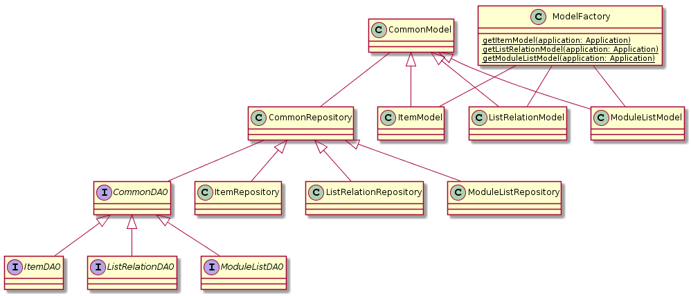

Jeg har lagt noe felles funksjonalitet i de generiske Common-klassene. Da slapp jeg å definere metoder for å legge til, oppdatere og slette elementer for hvert av modellene manuelt. Godene med dette hadde vært tydeligere dersom jeg hadde hatt fere entiteter, men jeg mene at jeg fikk igjen for generaliseringen i mitt prosjekt også. 

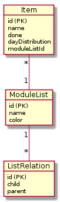
Selve database-arkitekturen er forholdsvis enkel, men den fungerte mer enn godt nok for det jeg trengte. 

### Lokal lagring generelt 

I min oppgave bruker jeg hovedsaklig SQL-databaser til å lagre data. Det finnes andre lagringsmetoder i Android: ekstern/intern fil-lagring og "SharedPreferences". SharedPreferences egner først og fremst godt til lagring av enklere datatyper, og opererer på "key-value"-parr[<sup>11</sup>](#11). Ikke til data om listene.

Internt og eksternt storage er enda mulighet som jeg kunne brukt. Det egner seg til litt større megnder data, men jeg konkluderte med at en relasjonsdatabase passer enda bedre fordi dataen er strukturert[<sup>12</sup>](#12). Med en relasjonsdatabase kan jeg dessuten gjøre spørringer på dataen (f.eks. hente ut etter X kritereie). SQL-databaser er godt optimalisert for akkurat denne oppgaven, særlig sammenlignet med de andre alternativene.

Videre er "SharedPreferences" i ment for å lagre enklere data som `String`, `Int` osv. 
Man kunne konvertert objektene frem og tilbake til et format som JSON-strings, men det ville forkludret koden unødvendig mye i forhold til gevinsten, slik jeg vurderte det.  

Shared preferences egner seg derimot godt til klassiske "key-value"-scenarier. Det går også kjappere å lese fra "SharedPreferences" enn fra en SQL-database. Derfor har jeg valgt å bruke "SharedPreferences" for å lagre fargetemaene. 

### Multithreading 
Når jeg gjør operasjoner mot databasen, er det viktig å kjøre den koden i en separat tråd. det er fordi at koden er tidkrevende, og da risikerer man å "blokkere" UI. Dette gir en svært dårlig brukeropplevelse. De brukes også til API-kall, som er en annen tidkrevende prosess.

Noen steder har jeg fulgt oppsettet som ble brukt i forelesning. Det vil si at jeg bruker [@WorkerThread](https://developer.android.com/reference/android/support/annotation/WorkerThread) i Repository-klassene, og returnerer `LiveData`, som jeg siden kan lytte på. 
__notis:__: henter repository gjennom "Modeller". (se [tidligere i rapporten](#database))
```kotlin 
val liveModuleLists = ModelFactory
    .getModuleListModel(activity!!.application)
    .getAllModuleListsLive()

liveModuleLists.observe(this, Observer {
    
    it?.let { moduleLists ->

        // gjøre noe med listene fra databasen 
    }
})
```

Jeg likte denne måten å gjøre det på når jeg skulle få data fortløpende, i et GUI e.l. Når jeg derimot skulle gjøre ting hvor løpende oppdateringer ikke var nødvendig, har jeg brukt `AsyncTask`. Jeg har også droppet LiveData. Dette sparte meg for mange linjer kode som observe-patternet ville gitt (f.eks. i `AddItemTask.kt`). Ulempen med min måte å gjøre det på, er at en del spørringer mot databasen måtte legges in dobbelt: 
```kotlin 
@WorkerThread
fun getByModuleListIdLive(id: Long) =
        itemDAO.getByModuleListIdLive(id)

fun getByModuleListId(id: Long): List<Item> =
            itemDAO.getByModuleListId(id)
```

Jeg likte AsyncTask fordi jeg hadde sans den eksplisitte måten å definere output/input-typer gjennom generics. Jeg kunne også valgt å bruke [Anko](https://github.com/Kotlin/anko). Da hadde jeg fått et API som er langt mer minimalistisk. Jeg gikk vekk fra det, rett og slett fordi jeg ble komfortabel med AsyncTask relativt fort, og likte å jobbe med det. Nedlasning av et tredjepartsbibliotek tar dessuten plass, som er unødvendig når AsyncTask allerede ligger tilgjengelig. 


## Intents 
Intents er, kort fortalt, en melding om at man ønsker at en handling skal håndteres av noen andre.
Jeg bruker både eksplisitte og implisitte intents. 

Eksplisitte intens brukes når jeg skal starte mine egne activities og services, samt med "Google Places-Input".
Implisitte intens   

Implisitte intents forteller sender jeg de gangene jeg vil at brukeren/android-systemet skal kunne velge sine egne måter å håndtere noe på. Jeg definerer altså ingen mottaker ekplisitt. 
Dette gjør jeg b.la. for å åpne kalender og for å dele en liste. Her legger ikke jeg meg opp i hva slags kalender eller meldingsapp brukeren skal benytte seg av, jeg stoler bare på at det finnes _en eller annen_ applikasjon som kan gjøre det, og at systemet/brukeren har valgt den løsningen som fungerer best.

## Services og notifications 
Jeg bruker en Service til å fange opp geofence-hendelser. Deretter sender jeg en notifikasjon til brukeren, fra den samme Service-klassen (`TransitionService.kt`). Man kunne tenke seg at denne burde kjøre hele tiden, sånn at man kunne være sikker på at man fikk varsel på det stedet man ønsket. For apper som har API level 26 eller høyere (som min har), er det lagt flere begrensinger på hva en Service (mer spesifikt, "Background Services") kan gjøre[<sup>13</sup>](#13). 

Her kunne jeg valgt å bruke en "Foreground Service" istedenfor. En foreground service kan kjøre selv om dens tilhørende app ikke kjører. "Ulempen" er at man er nødt til å vise et varsel om at Servicen kjører hele tiden. I sum er det lett å argumenterer for at dette en veldig god ting. Personvern på maskiner som er veldig viktig for mange, undertegnede inkludert. 

Grunnen til at det er en ulempe for meg, er at en pakkeliste-app ikke føles viktig nok til å alltid vise en notifikasjon. Både jeg og en del av dem jeg [brukertestet](#brukertest), sa at noe slikt ville gjort at de likte appen mindre.

Derfor kjører Service-klassen bare når appen er oppe. 

## Strings 
Der hvor jeg har statiske strings som skal møte brukeren, har jeg lagt dem i `strings.xml`. På denne måten, blir det lettere å oversetet appen på et senere tidspunkt, dersom jeg skulle ønske å treffe markeder hvor brukerne ikke kan lese engelsk[<sup>14</sup>](#14)

## Brukertest
Jeg har gjennomført brukertester med venner og bekjente. Jeg har passet på å la både "tekniske" og "ikke-tekniske" kjente. Det vil si at jeg også testet folk som ikke er vant til å bruke mange apper og som sjelden lærer seg å bruke nye programmer. 

Jeg fikk flere tilbakemeldinger: 
* Ikke alle skjønte at de kunne redigere Seekbaren på item-skjermen. Dette var noe særlig de ikke-tekniske brukerene slet med. Derfor satte jeg den som default til 7. Da ligger den litt under hallveis mot midten. Min hypotese var at fargen ville skjære litt i resten av bildet, og at det ville gjeore at folk la merke til den. Jeg later til å ha hatt noe rett i det, for folk så den mye tidligere enn før etter denne endringen .
* Da jeg startet testene, var jeg litt usikker på om fargene var mer i veien enn til hjelp. De tar tross alt litt tid fra brukeren under oppsett av en liste, og de har ikke nødvendigvis så mye funksjonlitet. Jeg fikk derimot beskjed av testobjektene om at dette var noe de likte. Derfor beholdt jeg det videre. 
* De aller fleste som testet synes at det var litt vanskelig å få tak på konseptet i appen til å begynne med. De synes det var lettest var (ikke så overraskende) de som hadde kjennskap til objektorietert programmering. Mange av de mindre tekniske testobjektene, trengte lenger tid. Dette førte til to ting: 
  1. Instruksjonsvideoer som en veldig lett tilgjengelig del av appen 
  2. Enkelhet rundt konseptet. Jeg har skrevet mer om dette [tidligere i dokumentet](#tidlige-skisser).
* Jeg forhørte meg om hva folk tenkte om varselet vedrørende at `TransitionService.kt` kjørte som en "Foreground Service". Det var folk stort sett negative eller nøytrale til. Derfor gjør den ikke det, delvis på bekostning av varsel-funksjonaliteten.  

Appen har først og fremst blitt kjørt på min egen [Moto E Play](https://www.motorola.com/us/products/moto-e-play-gen-5). 

## Visuelt
Jeg har holdt meg til Material Design, og Google sine standard-komponenter. Disse er kjente for brukeren. Det er lagt opp til at brukeren skal kunne endre fargetema gjennom instillinger-skjermen. 

Jeg har også laget et ikon til appen.


## Support-bibliotek
Da jeg startet på Modulist, brukte jeg de samme support-bibliotekene som ble brukt i undervisningen. Support-bibliotekene gir bakoverkompatibilitet med tidligere versjoner av Android. Etter hvert byttet jeg til AndroidX, som er erstatningen på de gamle support-bibliotekene[<sup>15</sup>](#15). 

Migreringen ble veldig enklel. Android Studio hadde en egen knapp som mer eller mindre gjorde alt for meg. 

Utgangspuntet for at jeg ønsket å bytte, var at jeg oppdaget at noen bibliotek ikke fungerte like bra (eller ikke i det hele tatt) med mindre man hadde AndroidX. Særlig støtte jeg på problemer med [biblioteket jeg bruker til Youtube-spillere](https://github.com/PierfrancescoSoffritti/Android-YouTube-Player).


## Øvrige bibliotek
* [Android Material Color Picker](https://github.com/Pes8/android-material-color-picker-dialog)
  * Brukes for å få fine dialoger for å velge farge.
* Lokasjons-API Fra google 
  * brukes til lokasjonstjenester, for stedssøk og geofencing 
* [Android-SimpleLocation](https://github.com/delight-im/Android-SimpleLocation)
  * tar svært liten plass
  * gir veldig enkelt tilgang til brukerens lokasjon, gjennom Google sitt API 
* [OkHttp](https://github.com/square/okhttp)
  * intuitivt API for å kalle eksterne API-er
  * se `FetchWeatherTask.kt` for bruk
* [Klaxon](https://github.com/cbeust/klaxon) 
  * object-binding mellom Kotlin-objekter og JSON-strings.
  * se `FetchWeatherTask.kt` for bruk
* [GraphView](https://github.com/jjoe64/GraphView)
  * brukes til å vise vær-grafen 
  * Har et API som var langt mer intuitivt enn [MPAndroidChart](https://github.com/PhilJay/MPAndroidChart), som også ble vurdert. Sistnevnte har flere muligheter, men jeg trengte ikke de muligheten. 
* [Android-YouTube-Player](https://github.com/PierfrancescoSoffritti/Android-YouTube-Player)
  * Brukes til instruksjonsvideoer
  * Jeg valgte dette over Google sitt alternativ fordi dette så ut til å være bedre støttet og dokumentert på en mer forståelig måte. 

## Versjoner
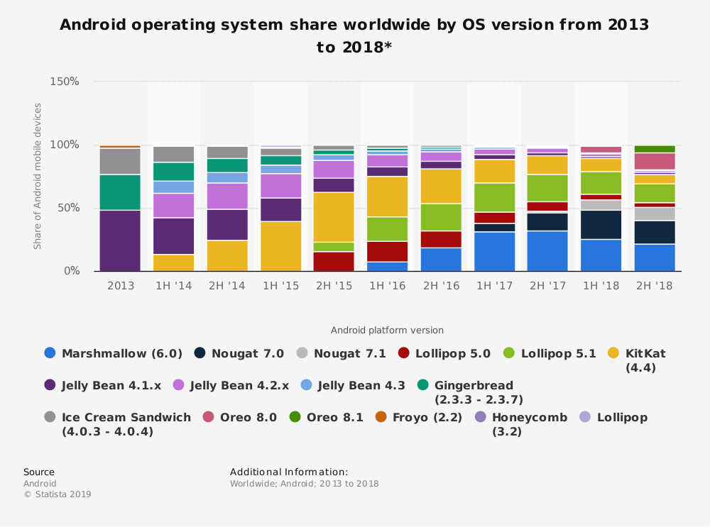
(Grafen er hentet fra _Statistia_[<sup>16</sup>](#16))

Brukere på Android er, som grafen viser, svært spredt. Derfor har valget av versjon en del å si for hvilke brukere som har mulighet til å bruke appen. Denne appen er laget mot API level 26 som minimum. Det vil si at jeg har utelukket en god del brukere (spesielt på global basis[<sup>17</sup>](#17))). Jeg har allikevel valgt å gjøre dette av tre grunner: 
1. Det gjør livet som utvikler morsommere å være med på nye versjoner, synes jeg. Arugmentet er kanskje litt følelsesladd, men jeg har hatt lyst til å lage morsomme ting, ikke tilpasse meg gamle versjoner og "depricated" APIer.
2. Google har gitt uttrykk for at de ønsker at folk skal jobbe mot de nyere versjonene, og at de ønsker at brukerene skal dit[<sup>14</sup>](#18) 
3. i Norge og tilsvarende land, er det forholds vis mange som ligger på de nyeste versjonene uansett, og det er mot disse landene at appen er publisert i Play Store[<sup>19</sup>](#19) 

## Navngivning 
(samme som i _Tic Tac Toe_)

Mange av navngivningskonvensjonene jeg har fulgt er veldig vanlige, standard-konvenserjoner. 
B.la. bruker jeg [Camel Case](https://en.wikipedia.org/wiki/Camel_case) på de aller fleste variablelnavn. Kosntanter har store bokstaver. 

Hva navngivning av XML-id'er har jeg ikke vært like tradisjonell. Her har det vært ekstra viktig å ha en navngivningskonvensjon som faktisk er _helt_ identifiserende. Dette er fordi at ID'ene er tilgjengelige i globalt scope. Konvensjonen jeg landet på har følgende sturktur: "parent, type"\_"parent, navn"\_"element, type"_"element, navn". Under er et eksempel i en activity som heter `DemoActivity`. ID er satt på `TextView`-tagen: 
```XML
<?xml version="1.0" encoding="utf-8"?>
<android.support.constraint.ConstraintLayout
        xmlns:android="http://schemas.android.com/apk/res/android"
        xmlns:tools="http://schemas.android.com/tools"
        tools:context=".gui.DemoActivity">

     <TextView
        <!-- ID med min konvensenjon: -->
        android:id="@+id/activity_demo_text_welcome_message"
        android:text="Hei, velkommen til min demo!"
        app:layout_constraintStart_toStartOf="parent"
        app:layout_constraintTop-toBottomOf="parent"
      />

</android.support.constraint.ConstraintLayout>
```

Sammensatte ord separeres også med understrek ("activity_demo_text_welcome_message", ikke _activity_demo_text_welcomeMessage"). Det kan være litt forvirrende, men mitt personlige inntrykk var at dette var bedre å forholde seg til det ørlille usikkerhetsmomentet enn å ha blandingen av store og små bokstaver der jeg allerde separerte med "_". 

Når jeg refererer til XML-elementer i Kotlin-kode, har jeg brukt [Kotlin View Binding](https://kotlinlang.org/docs/tutorials/android-plugin.html#view-binding). Der har spart meg for masse unødvendig "boilerplate"-kode. Det har også gjort at de lange navnkonvensjonene mine ikke har vært  så til hinder som man kanskje kunne frykte 
```kotlin

// uten view binding 
val textPlayer1 = findViewById(R.id.fragment_game_text_player1) as TextView; 
textPlayer1.setTextColor(activePlayerColor)

// med view binding 
fragment_game_text_player1.setTextColor(activePlayerColor)
```


## Publisering 
Appen er publisert til [Play Store](https://play.google.com/store/apps/details?id=org.olaven.modulist)
Prosjektet ligger også på et [github-repo](https://github.com/olaven/modulist)


## Kildeliste 
__note__: Der tilstrekkelig informasjon ikke er oppgitt, kommer det frem i kildehenvisningen.
* <span id="1">1:</span> https://play.google.com/store/search?q=todo&c=apps
* <span id="2">2:</span> https://itunes.apple.com/us/app/wunderlist-to-do-list-tasks/id406644151?mt=8#see-all/customers-also-bought-apps
* <span id="3">3:</span> Uspesifiert forfatter, Google. NA. “Floating Action Buttons”. https://material.io/develop/android/components/floating-action-button/ (lastet ned 27. April 2019)
* <span id="4">4:</span> Rahul Reddy. 28 Juli 2017. “Smartphone vs Tablet Orientation: Who’s Using What?”. https://www.scientiamobile.com/smartphone-vs-tablet-orientation-whos-using-what/ (lastet ned 28. April 2019)
* <span id="5">5:</span> Uspesifisert forfatter, Google. NA. “Introduction to Activities”. https://developer.android.com/guide/components/activities/intro-activities (lastet ned 28. April 2019)
* <span id="6">6:</span> Uspesifisert forfatter, Google. NA. “Understand the Activity Lifecycle”. https://developer.android.com/guide/components/activities/activity-lifecycle (lastet ned 28. April 2019)
* <span id="7">7:</span> Uspesifisert forfatter, Google. "Create and Manage Notification Channels”. https://developer.android.com/training/notify-user/channels (lastet ned 28. April 2019)
* <span id="8">8:</span> Uspesifisert forfatter, Google. NA. "Set the importance level". https://developer.android.com/training/notify-user/channels#importance (lastet ned 28. April 2019)
* <span id="9">9:</span> Uspesifisert forfatter, Google. NA. "Request App Permissions". https://developer.android.com/training/permissions/requesting (lastet ned 29. April 2019)
* <span id="10">10:</span> Uspesifisert forfatter, Google. NA. "Save data in a local database using Room". https://developer.android.com/training/data-storage/room/ (lastet ned 28. April 2019)
* <span id="11">11:</span> Obaro Ogbo. 21 September 2016. "How to store data locally in an Android app". https://www.androidauthority.com/how-to-store-data-locally-in-android-app-717190/ (lastet ned 28. April 2019)
* <span id="12">12:</span> Uspesifisert forfatter, Google. NA. "Data and file storage overview". https://developer.android.com/guide/topics/data/data-storage (lastet ned 28. April 2019)
* <span id="13">13:</span> Uspesifisert forfatter, Google. NA. "Services overview". https://developer.android.com/guide/components/services (lastet ned 28. April 2019)
* <span id="14">14:</span> Uspesifisert forfatter, Google. NA. "Localize your app". https://developer.android.com/guide/topics/resources/localization.html (lastet ned 29. April 2019)
* <span id="15">15:</span> Uspesifisert forfatter, Google. NA. "AndroidX Overview". https://developer.android.com/jetpack/androidx/#using_androidx (lastet ned 28. April 2019)
*  <span id="16">16:</span> Android. October 2018. “Android version market share distribution among smartphone owners as of September 2018". https://www.statista.com/statistics/271774/share-of-android-platforms-on-mobile-devices-with-android-os/ (lastet ned 27. April 2019)
*  <span id="17">17:</span> Uspesifiert forfatter, Google. 2019. “Distribution dashboard”. https://developer.android.com/about/dashboards/ (lastet ned 29. April 2019)
* <span id="18">18:</span> Uspesifiert forfatter, Google. NA. “Meet Google Play's target API level requirement” https://developer.android.com/distribute/best-practices/develop/target-sdk (lastet ned 29. April 2019)
* <span id="19">19:</span> Uspesifiert forfatter, statcounter. NA. “Mobile & Tablet Android Version Market Share Norway” http://gs.statcounter.com/android-version-market-share/mobile-tablet/norway (lastet ned 29. April 2019)


## Vedlegg
### Tidlig skisse 
 
### Skisse - lister 
 
### Skisse - listeflyt 
 
### Skjermbilde - navigasjon
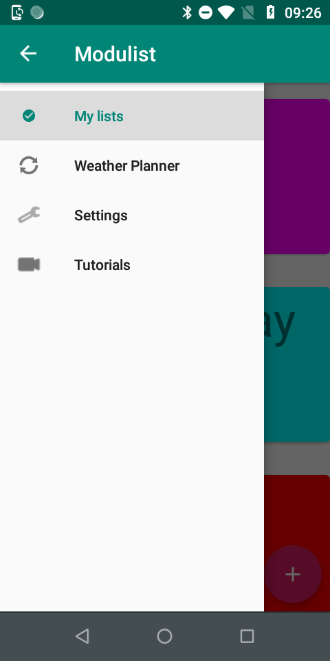 
### Skjermbilde - alle lister 
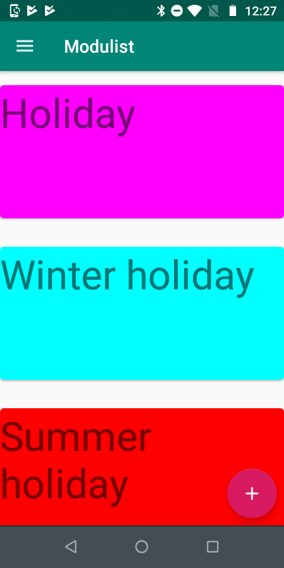
### Skjermbilde - en liste
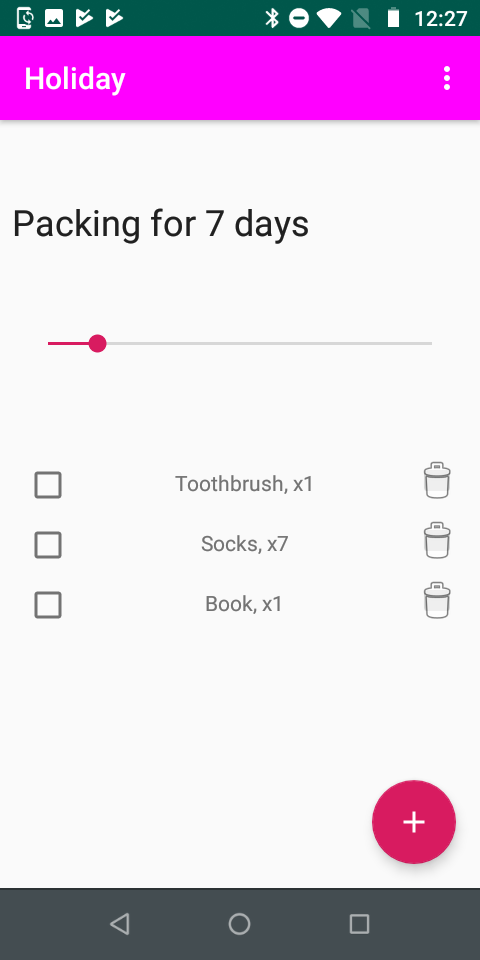 
### Skjermbilde - meny på liste 
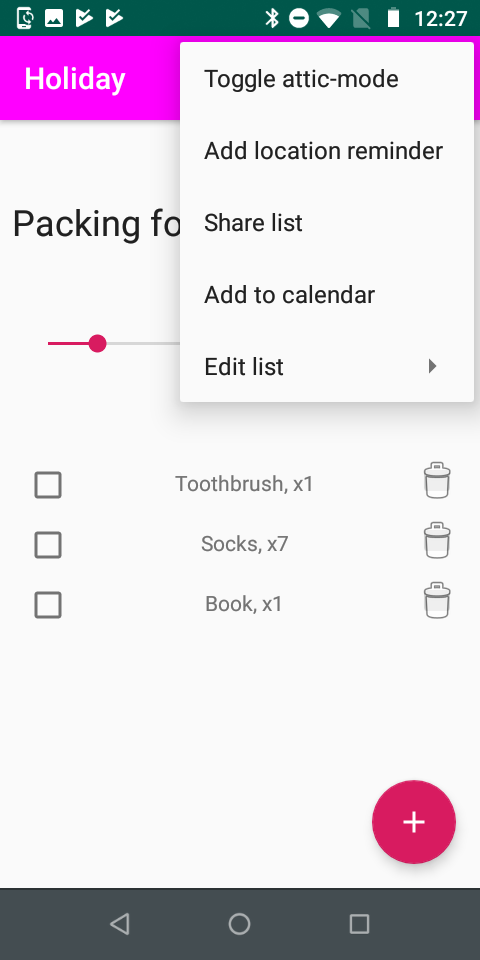 
### Skjermbilde - redigeringsmeny på liste 
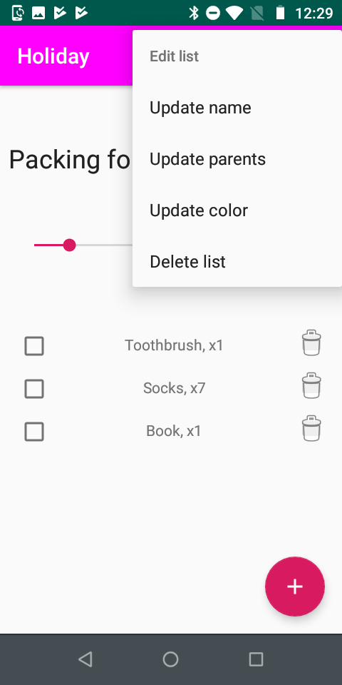 
### Skjermbilde - vær-planlegging 
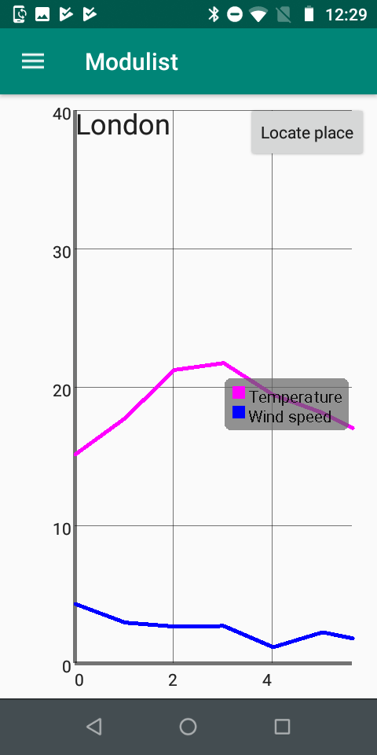 
### Skjermbilde - innstillinger 
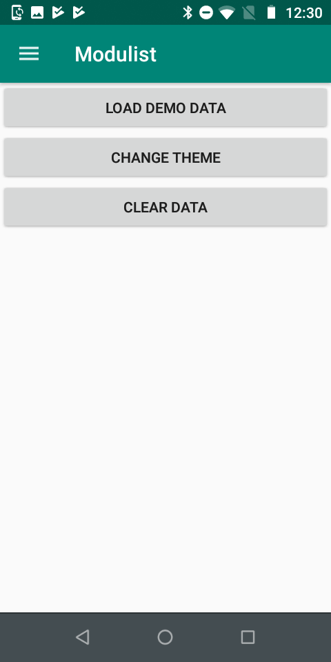 
### Skjermbilde - instruksjonsvideoer
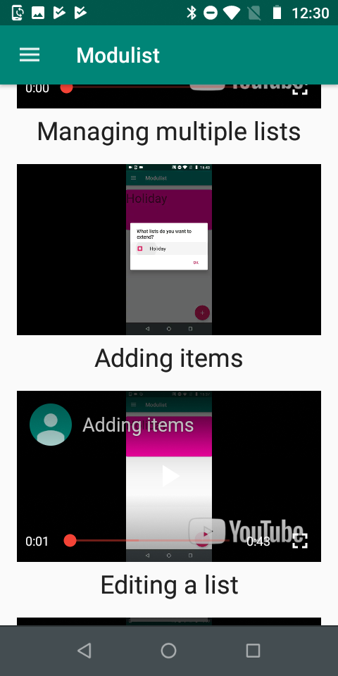 